<div align="center">
  <h1>
    <br/>
    Flutter ChatGPT with Clean Architecture
  </h1>
  <h3>An Advanced AI Chat Application with Text and Image Generation</h3>
</div>

<p align="center">
    <a href="https://github.com/jamalihassan0307/" target="_blank">
        
    </a>
    <a href="https://www.linkedin.com/in/jamalihassan0307/" target="_blank">
        
    </a>
</p>

## 📌 Overview

A sophisticated Flutter application that integrates OpenAI's ChatGPT API for text conversations and image generation. Built with clean architecture principles, the app offers a seamless AI chat experience with advanced features and customizable themes.

## 🚀 Tech Stack

- **Flutter** (UI Framework)
- **Riverpod** (State Management)
- **OpenAI API** (AI Integration)
- **Clean Architecture**

## 🔑 Key Features

- ✅ **AI Chat Interface**: Smooth conversation experience with ChatGPT
- ✅ **Image Generation**: Create images using AI
- ✅ **Theme Customization**: Multiple theme options with custom colors
- ✅ **Code Highlighting**: Proper formatting for code blocks
- ✅ **Message Management**: Copy, share, and delete messages
- ✅ **Authentication**: Secure user login and signup
- ✅ **Responsive Design**: Works across different screen sizes

## 📸 Banner

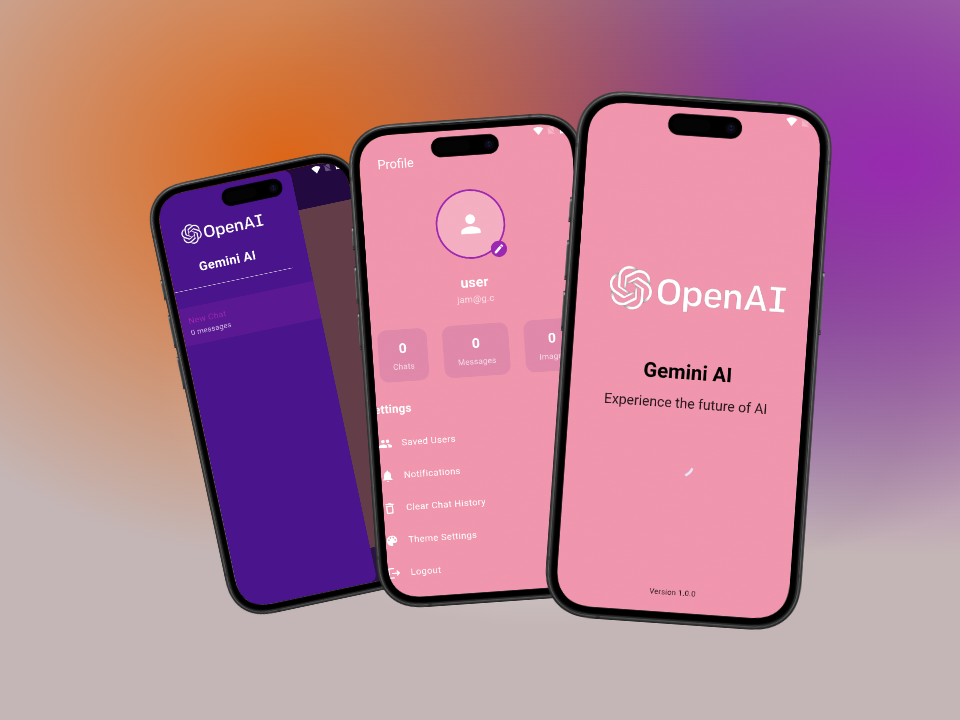

## 📸 Screenshots

### Authentication & Home

<table border="1">
  <tr>
    <td align="center">
      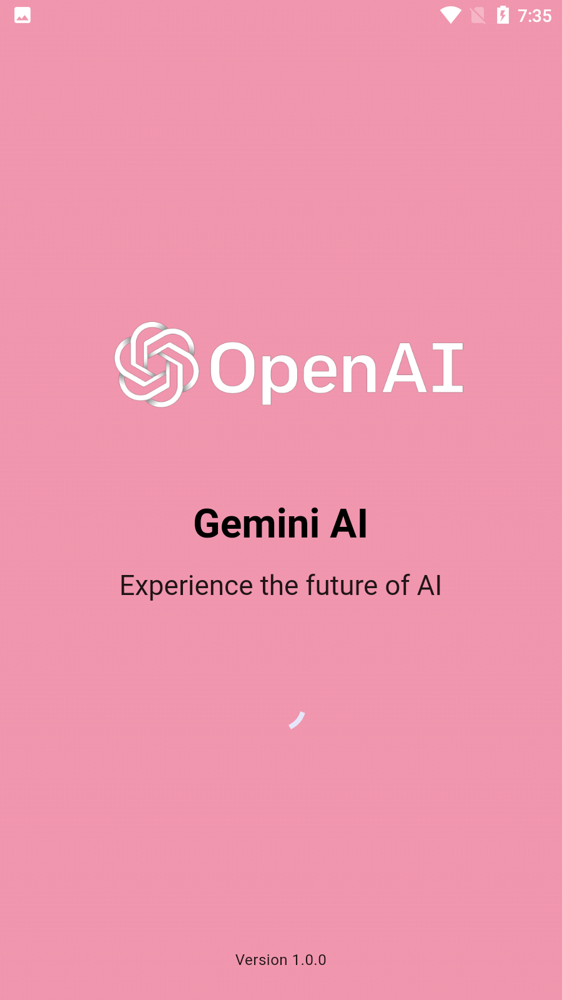
      <p><b>Splash Screen</b></p>
    </td>
    <td align="center">
      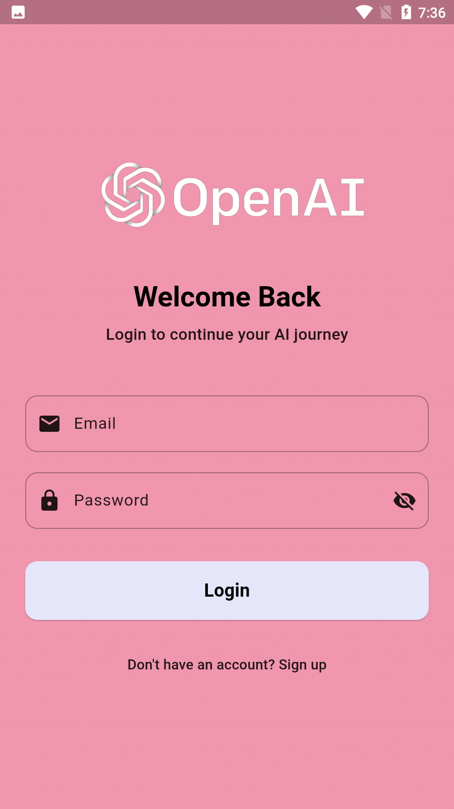
      <p><b>Login Screen</b></p>
    </td>
    <td align="center">
      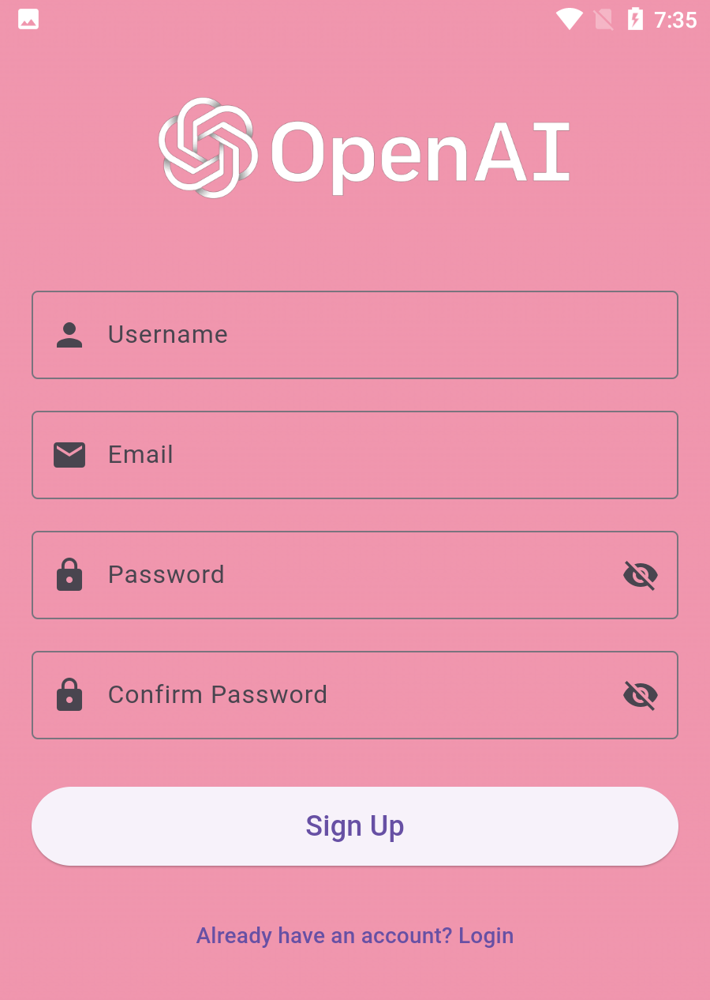
      <p><b>Signup Screen</b></p>
    </td>
  </tr>
</table>

### Chat Interface

<table border="1">
  <tr>
    <td align="center">
      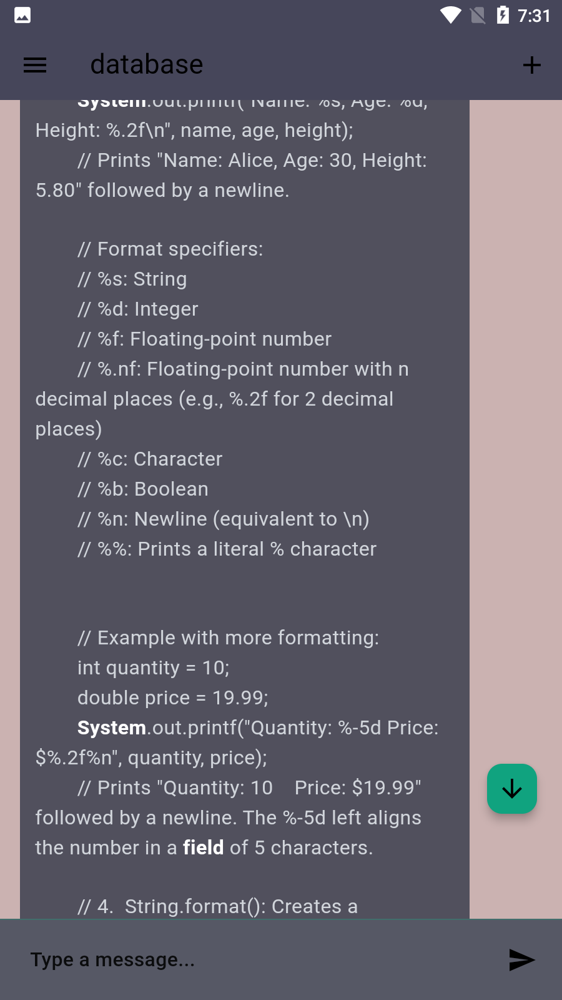
      <p><b>Chat Interface</b></p>
    </td>
    <td align="center">
      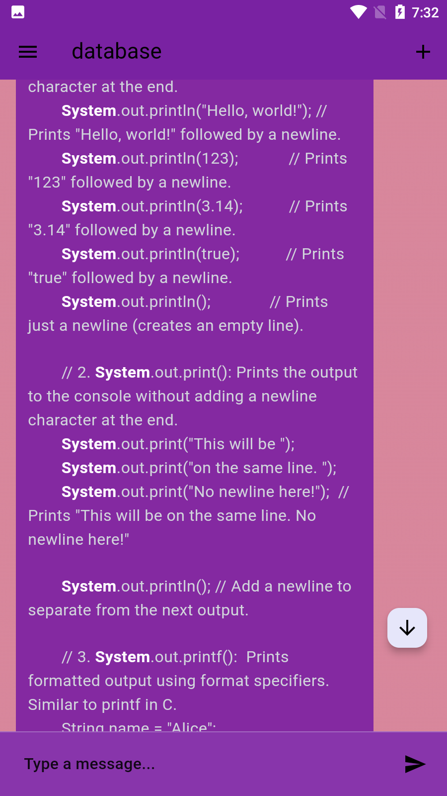
      <p><b>Themed Chat</b></p>
    </td>
    <td align="center">
      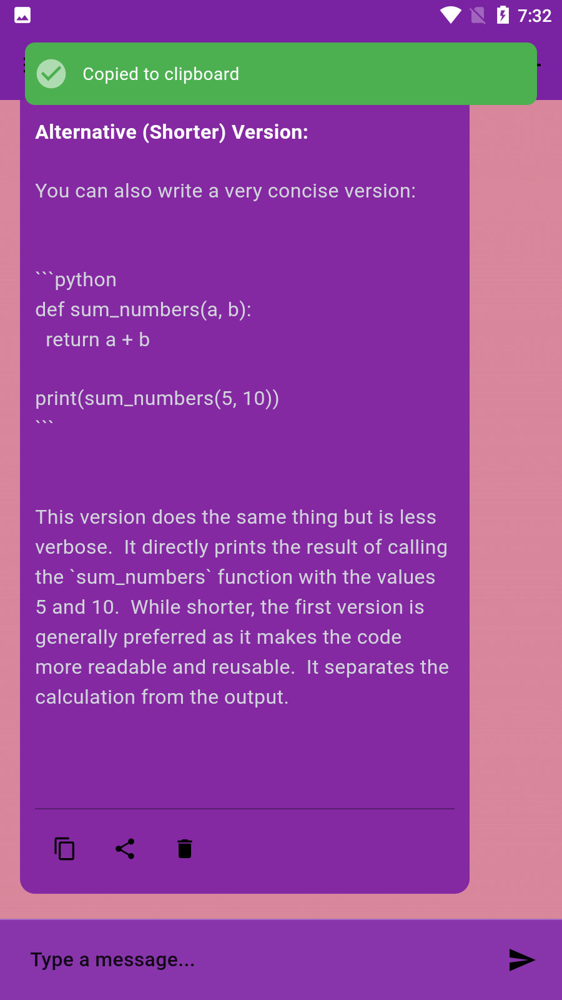
      <p><b>Copy Message</b></p>
    </td>
  </tr>
  <tr>
    <td align="center">
      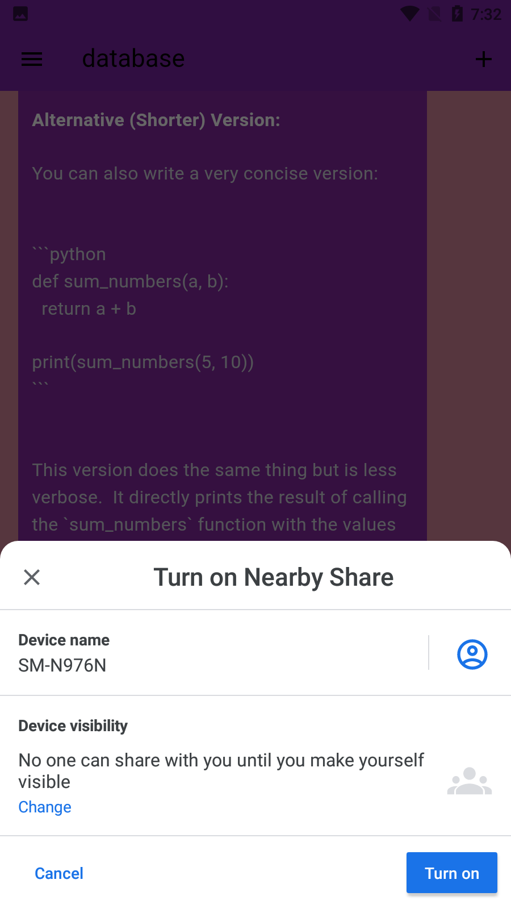
      <p><b>Share Message</b></p>
    </td>
    <td align="center">
      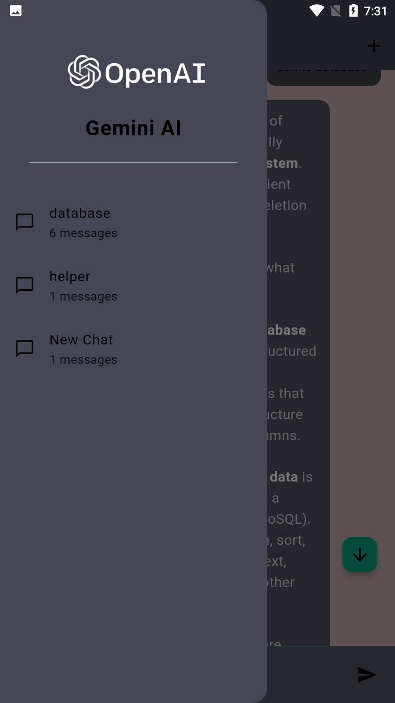
      <p><b>Navigation Menu</b></p>
    </td>
    <td align="center">
      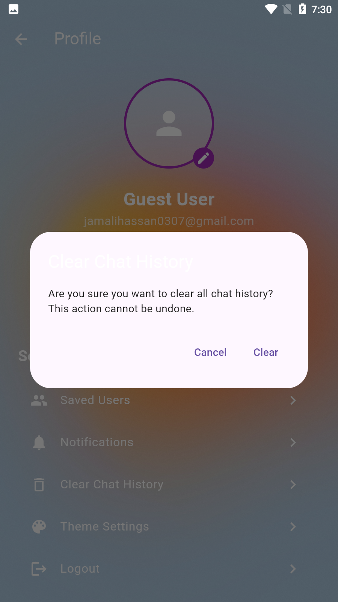
      <p><b>Clear Chat</b></p>
    </td>
  </tr>
</table>

### Theme Customization

<table border="1">
  <tr>
    <td align="center">
      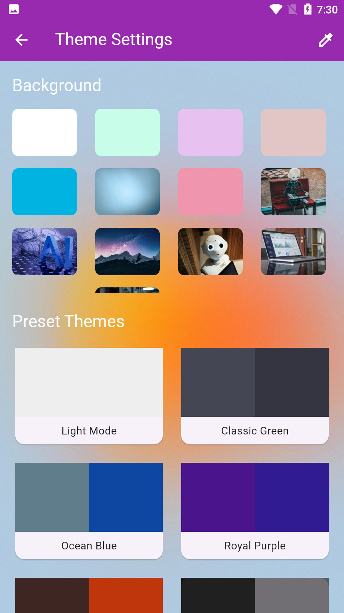
      <p><b>Theme Selection</b></p>
    </td>
    <td align="center">
      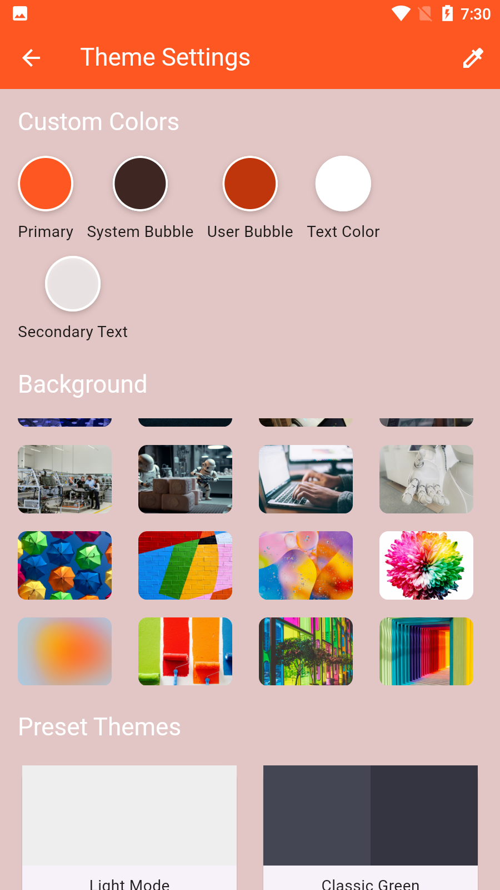
      <p><b>Custom Colors</b></p>
    </td>
    <td align="center">
      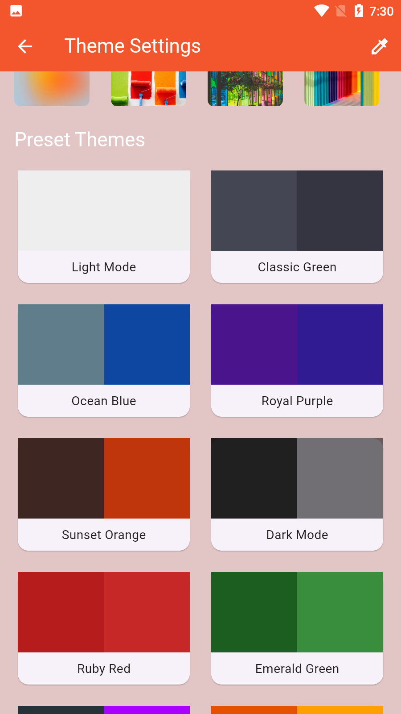
      <p><b>Theme Preview</b></p>
    </td>
  </tr>
</table>

## 📁 Project Structure

```
lib/
├── bloc/
│ ├── chat_bloc.dart
│ └── chat_event.dart
│ └── chat_state.dart
├── models/
│ └── chat_message.dart
├── repositories/
│ └── chat_repository.dart
├── screens/
│ ├── chat_screen.dart
│ └── home_screen.dart
├── services/
│ └── api_service.dart
├── utils/
│ └── constants.dart
└── main.dart
```

## 📦 Installation

1. Clone the repository:

bash
git clone https://github.com/jamalihassan0307/Flutter-ChatGPT-Text-and-image-generater.git
bash
flutter pub get

2. Run the app:

bash
flutter run

## 👨‍💻 Developer

Developed by [Jam Ali Hassan](https://github.com/jamalihassan0307)

---

<p align="center">
  Made with ❤️ using Flutter and OpenAI
</p>
